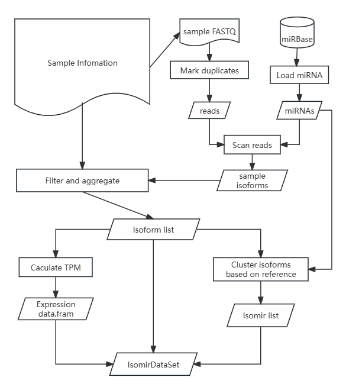

```{r, include = FALSE}
knitr::opts_chunk$set(
  collapse = TRUE,
  comment = "#>"
)
```

```{r setup}
library(risoma)
```

# Introduction
risoma is an R package developed to address the need for a comprehensive source of functions for constructing isomiR expression atlases using small RNA sequencing (RNA-seq) experiments. 
The primary goal of risoma is to provide an intuitive framework for identifying and constructing expression profiles. The package includes functions to assist with various tasks, such as detecting isomiRs, assessing expression metrics across different tissues and developmental stages, calculating tissue specificity indices to evaluate gene expression specificity, clustering, and visualizing expression patterns.


# Installation

## Requirments
```{r eval=FALSE}
if (!require("BiocManager", quietly = TRUE))
  install.packages("BiocManager")
BiocManager::install(version = "3.20")

BiocManager::install(c("Biostrings", "mirbase.db", "msa", "pwalign"))

```

## Insall from github
```{r eval = FALSE}
devtools::install_github("lchsz/risoma")
```

# Terminology

## The Isoform
The isoform is represented by reference miRNA ID, miRNA sequence, read sequence, read account and edit distance between read and reference miRNA.


```{r}
meta_data <- read.csv(sample_info_file,
                       stringsAsFactors = FALSE,
                       comment.char = "#")
fq_file <- file.path(fq_dir, meta_data$fq[[1]])
mirnas <- load_mirnas("vvi", 13)

detect_one_sample(fq_file, mirnas, max_ed_5p = 2, max_ed_3p = 3)
```

## The Isomir data class

We define isomiR as the all isoforms that clustered based on a reference miRNA.
The Isomir S4 class contains the mature miRNA ID, mature miRNA sequence, edit distance between isoform and it's reference, and the alignment between isoform and reference which is represented by Compact Idiosyncratic Gapped Alignment Report (CIGAR) strings.


## The IsomirDataSet data class

Risoma stores results of isomiRs called a IsomirDataSet.
The main components of an IsomirDataSet object are a list containing the isoforms, 
a data.frame containing expression profiles, and a list of isomir object.


## Naming and labeling isomiRs

The CIGAR makes it easy to state how an isomiR’s endpoints differ from the annotated ‘reference’ mature found in public databases. 
For example, the label ‘vvi-miR390-1I21M2I” refers to the isoform of vvi-miR390 whose 5’-end begins 1 nucleotides (nts) upstream of the miRbase reference’s 5’-end and 3’-end terminates 2 nts downstream of the miRBase reference’s 3’-end.


# Data input

```{r}
sample_info_file <- system.file("extdata", "sample_info.csv", package = "risoma")
fq_dir <- system.file("extdata", "fastqs", package = "risoma")
```

To perform an analysis using risoma for a specific organism, the user must input the following data: 

* a sample information file

Each line of the sample information file must contain three columns for the sample or library, FASTQ file and group, respectively. 
The group column identifies the tissue or developmental stage of each sample. 

* a set of known plant miRNAs from miRbase

* several sRNA libraries with at least two replicates. 
  
Technical or biological replicates can be used for assessing technical variation and noise between samples or for the exclusion of spurious results.


# The risoma pipeline



## Load miRNA information

```{r}
mirnas <- load_mirnas("vvi", 13)
mirnas
```

Extract plant known microRNA information from the miRBase database based on species names and store it in a data frame. 
Each row contains the mature miRNA ID (mature_id), miRNA sequence (mature_seq), precursor ID (pre_id), the position of the miRNA on the precursor (matur_start), precursor ID (pre_id), and precursor sequence (pre_seq). 
Set the length of the seed sequence to obtain the seed sequence (seed_seq) for subsequent sequence alignment.

## Detect isoforms from one sample

### Mark duplicated reads
To accelerate the reading of small RNA sequencing sequences and reduce memory usage, C++ is used to load sequences and store them as hash keys, merging identical sequences for counting, with the count stored as the value of that key. 
Finally, the number of reads for each type is stored in a data frame. 

### Align reads to reference miRNAs
A search starts with finding a perfect sequence match of length given by ”seed_size”.
This initial region of an exact sequence match is then extended in both directions (5' and 3'), allowing gaps and substitutions based on the scoring thresholds. 
The pairwise sequence similarity between a read and the reference miRNA is calculated using the Levenshtein distances— the number of deletions, insertions, or substitutions required to transform one string into the other. 
Usually, seed size should be less than half the query length; otherwise, reliable hits can be missed. 

### Caculate TPM (transcript per million)

$$
TPM = \frac{q_i/l_i}{\sum q_j/l_j} 10^6
$$

### Calculate CIGAR

Aggregate isofoms of samples (replicates) into it's tissue (group).

### Clustriing isoforms based on reference miRNAs


If the sample infomation file and path of coressponding FASTQ and reference 
micorRNA information are already available, then a IsomirDataSet object can be made by:


```{r}
isomirs <- detect_isomirs(sample_info_file, fq_dir, mirnas, type = "p5")
```

# Functions to inquiry and view results

Get all the reference miRNAs which have isoforms.

```{r}
get_ref(isomirs)
```


```{r}
get_tissues(isomirs)
```

```{r}
ex_isomir(isomirs, "vvi-miR390")
```

```{r}
expr <- ex_expr(isomirs, "vvi-miR390")

pheatmap::pheatmap(expr, scale = "row", fontsize_row = 4)
```

```{r}
aln <- aln_isoforms(isomirs, "vvi-miR390")
aln
```

Tissue specificity index

```{r}
calc_tsi(expr)
```


# Tissue specificity index

To evaluate the variability of expression patterns, we calculated a tissue specificity index (TSI) for each isomiR analogously to the TSI ‘tau’ for mRNAs originally developed by Yanai et al. (7). 
This specificity index is a quantitative, graded scalar measure for the specificity of expression of a miRNA with respect to different organs. 
The values range from 0 to 1, with scores close to 0 represent isomiR expressed
in many or all tissues (i.e. housekeepers) and scores close to 1 isomiR expressed in only one specific tissue (i.e. tissue-specific miRNAs). 
Specifically, the TSI for a isomiR is calculated as

$$
\tau=\frac{\sum_{i}^N (1-x_i)}{N-1}
$$
